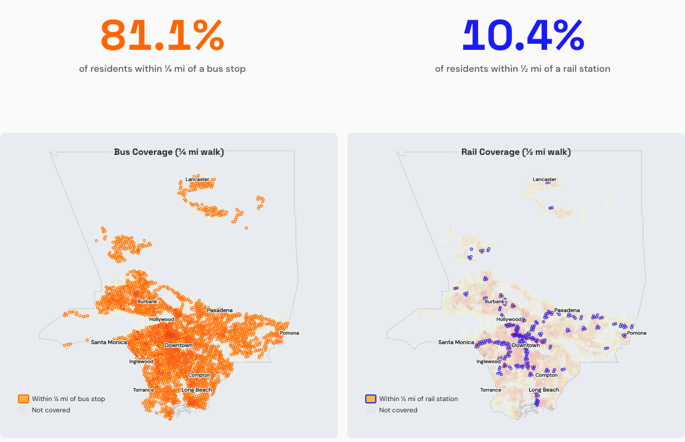
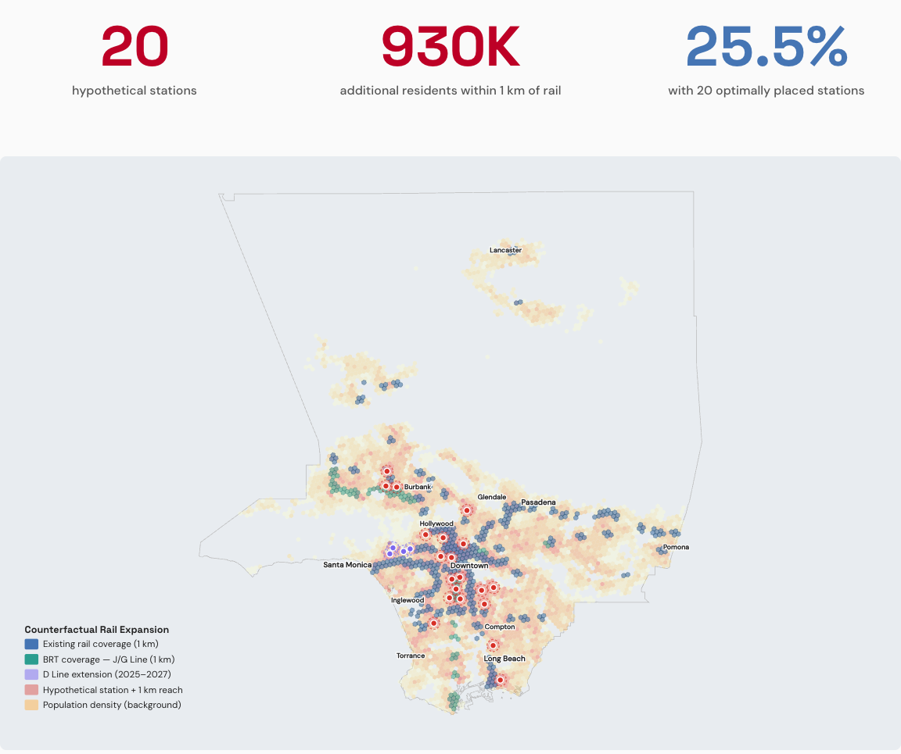

# Who Can Walk to Transit in Los Angeles County?

Los Angeles County has about 10 million residents and dozens of separate bus and rail operators. This project combines all of their public schedules with Census population counts to answer three questions:

1. **How many people live within a short walk of a bus stop or a rail station?**
2. **Which dense neighborhoods are underserved compared with similar places?**
3. **If you could add 20 rail stations anywhere, where would they reach the most people?**

## What I found

| | |
|---|---|
| **81.1%** of residents (8.1 million people) | live within a quarter-mile of a bus stop, about a 5-minute walk |
| **10.4%** of residents (1.0 million people) | live within a half-mile of a rail station, about a 10-minute walk |
| **About 930,000 more people** | would be within 1 km of rail if 20 new stations were placed where they reach the most people |

Buses reach most of the county. Rail reaches about one resident in ten, concentrated along a few corridors.



### Where 20 new stations would do the most good

Today about 15.5% of residents in the county's populated areas live within 1 km of a rail station. The D Line extension now under construction raises that to 16.1%. Twenty additional well-placed stations would raise it to 25.5%.



This is an illustration of the size of the gap, not a rail plan. It looks only at where people live. It ignores cost, engineering, and how stations would connect into lines.

## How it works

1. **Count people where they live.** Population comes from the 2020 Census at the census-block level (roughly a city block), the finest detail the Census publishes.
2. **Collect every stop.** Transit agencies publish their stops and schedules in a standard public format (GTFS). I combined 40 of these feeds from 39 agencies, including LA Metro bus and rail, Metrolink, Big Blue Bus, and the municipal operators, into one map of about 28,000 stops.
3. **Measure walking distance.** Draw a quarter-mile circle around every bus stop and a half-mile circle around every rail station. These are the standard distances transit planners use. A block counts as covered if its center falls inside a circle. Add up the people in covered blocks.
4. **Make neighborhoods comparable.** Census blocks vary a lot in size, so I overlaid a grid of equal-size hexagons (each about 0.7 square km) and divided each block's population among the hexagons it overlaps. Every hexagon gets a transit score based on how many routes run nearby and how often they run. Each hexagon is then compared with others of similar density, so a low score means "underserved for a place this crowded."
5. **Place the hypothetical stations.** Consider only dense areas with no rail within 1 km. Pick the spot whose 1 km circle covers the most people who lack rail, count those people as covered, and repeat 20 times.

## Limitations

- Distances are straight lines, not walking routes. Real walks are longer, so true coverage is somewhat lower.
- Being near a stop says nothing about how often the bus comes. The transit score in step 4 accounts for frequency; the headline coverage numbers do not.
- Population is from the 2020 Census; schedules are from 2026.
- The 930,000 figure is measured on the hexagon grid for populated areas (9.8 million people), and is in addition to the D Line extension.

## What's in this repository

| Folder | Contents |
|---|---|
| `Scripting/` | The analysis, as numbered Python scripts that run in order |
| `Data/` | The small result files behind the numbers above |
| `Website/` | A scrolling, map-based presentation of the findings, built with D3.js |
| `docs/` | Figures used on this page |

Raw data is not included because it is large and freely available from the original sources: the [U.S. Census Bureau](https://www.census.gov/) for population and block boundaries, and each agency's public GTFS feed for stops and schedules. The exact feeds are listed at the top of `Scripting/02_process_gtfs.py`.

## Run it

```bash
pip install -r Scripting/requirements.txt
cp .env.example .env        # then add a free Census API key
```

Download the block boundary files and the GTFS feeds into `Data/`, then run the scripts in `Scripting/` in numbered order. To view the presentation with the included data:

```bash
cd Website
python -m http.server 8000
```

The final "explore" section of the page expects a large interactive map file that is not included in this repository, so that one panel will appear empty.

**Tools:** Python, GeoPandas, H3, pandas, D3.js
